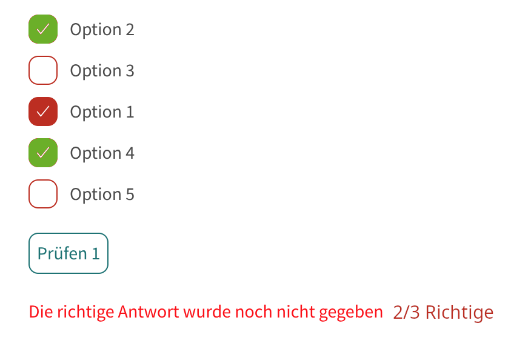
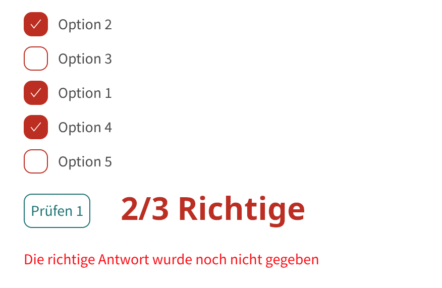

<!--

author: Volker Göhler
email: volker.goehler@informatik.tu-freiberg.de
version: 0.0.1
date: 2025-11-28
edit: true
title: Testbed für Multiple Choice Tests in LiaScript
language: de
-->

# Testbed für Multiple Choice Tests in LiaScript

Verschiedene Stimmen in der Benutzung unserer Multiple Choice Tests in LiaScript haben uns auf einige Probleme und Wünsche hingewiesen. Dieses Testbed soll helfen, diese Probleme zu analysieren und mögliche Lösungen zu testen.

## Probleme und Wünsche

Hauptproblem ist eine falsche Auffassung des Multiple Choice Tests Tools.
Entweder wir betrachten es in einem "Leistungskontrolle" Modus, oder in einem "Selbstlern" Modus.
- Bei einer Leistungskontrolle, hat der Delinquent nur einen Versuch, und die Bewerung seiner Leistung kann für Weiteres genutzt werden.
- In einer Selbstlernsituation soll der Lernende so oft üben können, wie er möchte, und idealerweise auch sofort Feedback bekommen.

Auf dieser Basis betrachtet können wir den Feedback einordnen:

- *Richtige* sollen markiert werden bei **check**, Bei zB 3 Versuchen werden jedesmal alle Richtigen markiert. Nur Sinnvoll für Selbstlernmodus.
- Wir verwalten einen Counter der Richtige pro Versuch zählt, und zeigen diesen am Ende an. Sinnvoll für beide Modi.
- **Jetztstand:** nur vollständig korrekte Antworten zählen als korrekt.

## Jetzstand

- Antworten 2,3 und 4 sind richtig
- Antworten randomiziert
- Lösungsbutton ist aus
- drei maximale versuche

<!-- 
data-randomize
data-max-trials="3"
data-solution-button="off" 
-->
- [[ ]] Option 1
- [[x]] Option 2
- [[x]] Option 3
- [[x]] Option 4
- [[ ]] Option 5

Nur wenn alle Optionen korrekt sind, wird die Aufgabe als Korrekt gewertet.

Es gibt zwar `data-show-partial-solution` aber das funktioniert nicht mit MCQ.

## Idee 1 "markiert Lösungen"

Bei den Durchgängen wird die richtige Unterlösung entsprechend markiert. Nur Sinnvoll bei Selbstlernsituationen um kein "ich klick mich einfach durch" zu provozieren. Optional mit einem Counter.

## Idee 2 "Richtige Lösungen Zähler"

Wir nutzen als zusätzliches "Hint" Element einen Zähler, der richtige vs. total Verwaltet.

## FAQ

- `Check`statt `Prüfen`: da fehlt `language: de` in der Preamble!
